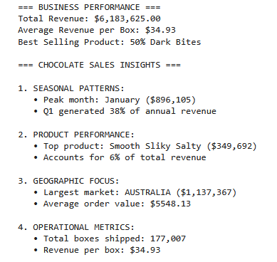
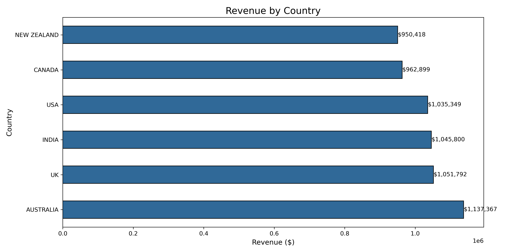
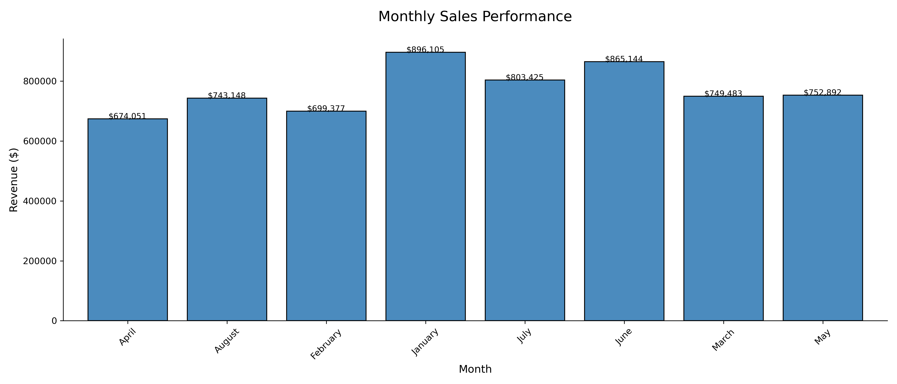
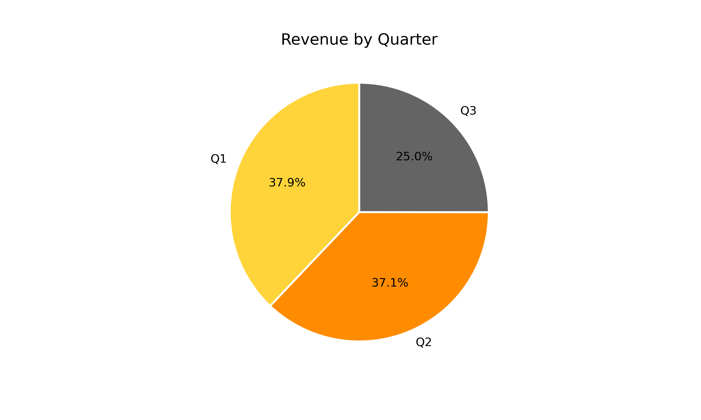

The dataset that I took was from kaggle https://www.kaggle.com/datasets/atharvasoundankar/chocolate-sales which is the basic premise of the project that I have made.

# Chocolate Sales Data Analysis

# Context of Project

A mid-sized Chocolate manufacturer is currently experiencing a couple of problems mainly about unpredictable inventory management where it frequently overstocks, declining customer retention and they have discovered that their marketing spending is ineffective.

As a Business Analyst that was employed by the company, they have asked a few questions that you are tasked to answer which is :

1. What are the Key sales trends by product, region and season?
2. Which customer segments are the most or least valuable?
3. How can we forecast demand to optimize production?

We will be answering the first question and that is :

# Key Findings

1. Product Performance
- Top Revenue Driver: Smooth Sliky Salty (6% of annual revenue).
- Top Volume Seller: 50% Dark Bites (highest units sold).
- Recommendation: Launch a premium version of Smooth Sliky Salty (e.g., flavor enhanced or artisan ingredients) to increase average order value.

2. Geographic Opportunity / Region
- Australia drove 18.4% of revenue ($1.14M) the highest among all markets.
- Recommendation: Create localized bundles pairing best sellers with Australian made ingredients to boost regional sales.

3. Revenue Trends & Marketing Allocation / Season
- Generated $6.18M annually, with Q1 (Jan-Mar) contributing 38% of total revenue.
- Recommendation: Allocate 40% of next year’s marketing budget to Q1 to capitalize on peak demand

Strategic Next Steps

- Run early bird discounts in Q1 to incentivize purchases during peak season.
- Develop an Australia-focused loyalty program to stregthen regional sales.

